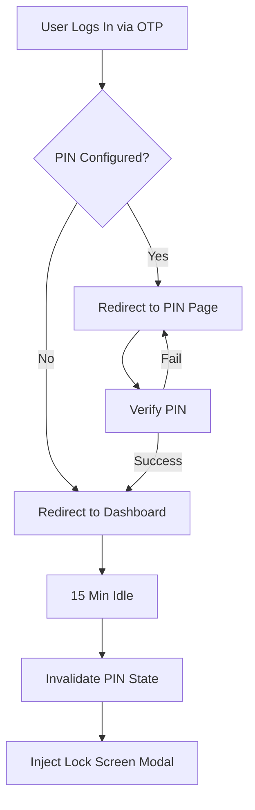
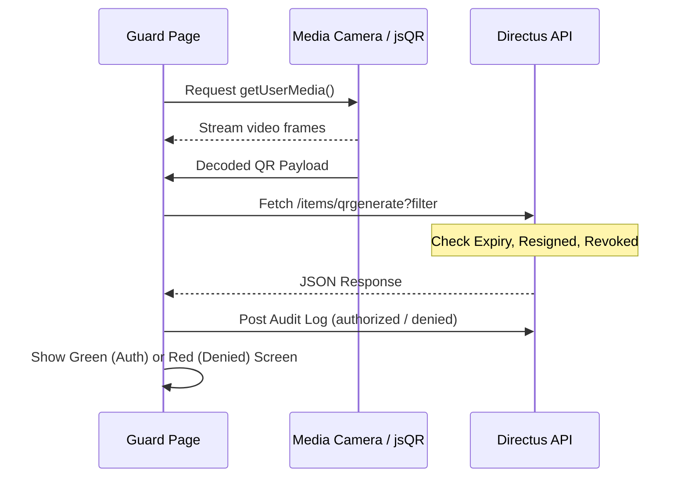
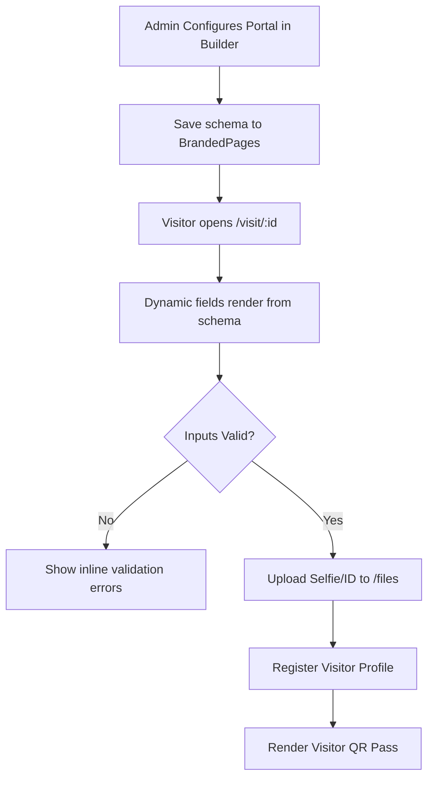

# Modern Web Frontend Flows & Production Test Cases Guide

Welcome to the **AccessEasy Web Frontend Guide**. This document outlines the core architecture, data flows, validation logic, and production test cases for each key module in the Vue 3 application. It is designed to help freshers and junior QA/developers rapidly understand how the systems operate and how to verify them for production release.

---

## 📂 Codebase & Architecture Overview

The application is built using **Vue 3 (Composition API)** with **Vite** and **Tailwind CSS**. 

### Core Structure:
- **Routing Engine**: [router/index.js](file:///Users/jeyak/accesseasy/src/router/index.js) — Manages routing layouts, path definitions, dynamic imports, and middleware guards.
- **State & Services**: [services/authService.js](file:///Users/jeyak/accesseasy/src/services/authService.js) — Coordinates APIs, token persistence, inactivity tracking, and login sessions.
- **Layouts**: [layouts/dashboardLayout.vue](file:///Users/jeyak/accesseasy/src/layouts/dashboardLayout.vue) — Contains sidebars, notification banners, global headers, and automatic QR pre-generation.
- **Pages**: `/src/pages` — Houses the individual screens for managers, guards, employees, and visitor portals.

---

## 🛡️ User Role Matrix & Route Protection

The router controls access using a role-based authentication check (`to.matched.some(record => record.meta.roles)`). If a user does not possess the correct role, they are redirected back to the `/dashboard`.

| Role | Access Scope |
| :--- | :--- |
| **esslAdmin** | Superadmin portal access (`/dealer-dashboard` / [EsslDashboard](file:///Users/jeyak/accesseasy/src/pages/dealers/dashboard/esslDashboard.vue)). |
| **Admin** | System configuration, doors, zones, branch creation, visitor portals, employee management, settings. |
| **Manager** | View employees, access levels, biometrics, logs, and live monitoring. |
| **Employee** | Self-Service dashboard, request mobile keys, RFID card viewer, personal check-in logs. |
| **Guard** | Security overview dashboard, access key scanners, visitor check-in validations. |

---

## 🔄 Flow 1: Authentication & Session Security

### 🔌 Technical Mechanics
1. **Login Flow**: Users log in using phone/email OTP or a development login override. The response is handled by `AuthService` which stores a bearer token in Cookies (`userToken`) and localStorage (`userToken`).
2. **PIN Verification Guard**: After OTP login, if the user has a PIN configured (`userPin` exists), the router redirects them to [pinVerification.vue](file:///Users/jeyak/accesseasy/src/components/loginAuthentication/pinVerification.vue). The route guard locks down all pages until `isPinVerified()` is true (`localStorage.getItem('pinVerifiedInSession') === 'true'`).
3. **Inactivity Lockout**: A background timer runs every 60 seconds (`setInterval` in `AuthService`). If no keyboard/mouse activity is detected on the window for 15 minutes (`900000ms`), `isPinVerified` is flipped to `false`, and a custom warning overlay is injected into the DOM, blocking access and prompting re-authentication.

### 🎯 Production Test Cases

#### Test Case 1.1: PIN Verification Redirection (Happy Path)
* **Goal**: Ensure users are blocked from dashboard if PIN verification is required.
* **Steps**:
  1. Clear browser storage and cookies.
  2. Perform OTP login with a test user who has `userPin` configured.
  3. Verify the browser redirects to `/pin-verification/...`
  4. Manually type `/dashboard` in the address bar and press Enter.
* **Expected Result**: The router intercepts the navigation and bounces the user back to the `/pin-verification` screen.
* **Automation Checklist**: Verify `router.beforeEach` triggers redirect when `!authService.isPinVerified()` is true.

#### Test Case 1.2: Inactivity Lockout Trigger
* **Goal**: Validate that 15 minutes of idle time de-authenticates the PIN state.
* **Steps**:
  1. Log in and verify the PIN to enter `/dashboard`.
  2. Open the browser console and manually set the last activity value: 
     `localStorage.setItem('lastActivityTime', (Date.now() - 1000000).toString())`
  3. Wait 60 seconds for the next interval verification check.
* **Expected Result**: A dark-themed **"Session Expired"** modal overlay occupies the screen, `pinVerifiedInSession` in localStorage is set to `false`, and clicking "Sign In Again" reloads the page to verification.

#### Test Case 1.3: Token Expiry Check on Page Reload
* **Goal**: Ensure a compromised or expired token on the server forces a soft logout.
* **Steps**:
  1. Set a fake token: `localStorage.setItem('userToken', 'invalid-token-123')`.
  2. Reload the page.
* **Expected Result**: The server API check fails (`validateToken() => false`). The router clears credentials and redirects the user to `/login?expired=true`.

---

## 🔍 Flow 2: Security & Authorization Key Scanner (Guard Portal)

### 🔌 Technical Mechanics
- **Scanner Execution**: [authorize/index.vue](file:///Users/jeyak/accesseasy/src/pages/authorize/index.vue) requests access to user media camera via standard browser APIs (`navigator.mediaDevices.getUserMedia`).
- **Realtime Scanning**: The raw video feed is rendered to a canvas, and the **`jsQR`** library continuously decodes frames looking for a QR payload.
- **Validation Handlers**: When a QR code is scanned:
  - **Timeout Guard**: An `AbortController` triggers a strict **10-second timeout** on the API call. If the backend fails to respond within 10 seconds, access is automatically denied.
  - **Employee Key Logic**: Fetches matching data from `/items/qrgenerate`. It performs client-side verification on token expiration (`expires_at`), deactivation status (`dateOfLeaving` validation), and checks if the access level is revoked (`status === 'inactive'`).
  - **Entry/Exit Toggle**: It queries today's log database. If an authorized log already exists for the day, it records the scan as **"out"** (Exit) and updates the database record by setting `qraccess: false` to invalidate the single-use key. If no prior log exists, it logs the scan as **"in"** (Entry).
  - **Visitor QR Fallback**: If the employee database lookup returns no match, the scanner parses the payload as JSON. If `type === 'VISITOR'`, it pipes the request to `/visitor-portal-flow/guardians/scan` for verification.
  - **Logger**: A live audit trail is written to `/items/logs` for every entry or denial.

### 🎯 Production Test Cases

#### Test Case 2.1: Camera Access & Denial Fallback
* **Goal**: Ensure the UI handles denied camera permissions gracefully.
* **Steps**:
  1. Open `/dashboard/authorize` in the browser.
  2. When the browser prompts for camera permissions, click **Block**.
* **Expected Result**: The scanner wrapper changes state to `'error'`, hides the video container, and displays a clean **"Camera Access Failed"** screen with a retry button.

#### Test Case 2.2: 10-Second API Timeout Guard (IN-14)
* **Goal**: Prevent gate lockups due to slow APIs by auto-rejecting.
* **Steps**:
  1. Mock the API call `fetch(/items/qrgenerate)` in the browser to delay for 12 seconds.
  2. Scan a valid QR code token.
* **Expected Result**: The scanner page remains on the "Decryption in progress" validating screen for exactly 10 seconds, then displays **Access Denied** (aborted by the internal timeout guard).

#### Test Case 2.3: Revoked Employee Verification (IN-15 / IN-10)
* **Goal**: Verify deactivated employees or inactive access groups are rejected at the gate.
* **Steps**:
  1. Configure an employee in the database with `dateOfLeaving` set to yesterday.
  2. Generate a QR code using that employee's ID.
  3. Scan the QR code using the scanner.
* **Expected Result**: The API match is found, but the client checks the date, flags it, displays **Access Denied**, and writes an `unAuthorized` event log.

#### Test Case 2.4: Single-Use Exit Invalidation (IN-09)
* **Goal**: Ensure employee QR keys are strictly single-use for entry/exit and cannot be recycled.
* **Steps**:
  1. Scan a newly generated employee QR token for the first time today. Verify that access is granted as **"Entry"**.
  2. Scan the same QR token again. Verify that access is granted as **"Exit"**.
  3. Scan the same QR token a third time.
* **Expected Result**: On the third scan, the system rejects the request as **Access Denied** because the second scan (Exit) patched the token in the database to `qraccess: false`.

---

## 📋 Flow 3: Branded Visitor Portals & Check-in

### 🔌 Technical Mechanics
1. **Admin Portal Builder**: Located at [visitorPortals/builder.vue](file:///Users/jeyak/accesseasy/src/pages/visitorPortals/builder.vue). Allows administrators to configure title, colors, and toggle required form fields (photo capture, ID proof document uploads, company detail, etc.). It uploads logos/banners to `/files` and commits the JSON schema to `/items/BrandedPages`.
2. **Visitor Registration**: Located at [visitorPortals/VisitorPortalView.vue](file:///Users/jeyak/accesseasy/src/pages/visitorPortals/VisitorPortalView.vue). It loads the branding details and renders custom validation rules based on `fieldsConfig`.
3. **File Attachments**: Selfies are taken using device camera video streams and converted to files. Documents are parsed as files. Both upload directly to Directus `/files` in the background prior to visitor registration.
4. **QR Generation**: Submits visitor details to the backend endpoint `/visitor-portal-flow/visitor`. The response contains a custom generated token, which is rendered dynamically in the browser using the `qrcode.vue` utility.

### 🎯 Production Test Cases

#### Test Case 3.1: Builder Form Customizer Synchronization
* **Goal**: Verify that form configurations update the backend schema properly.
* **Steps**:
  1. Navigate to the Portal Builder, toggle "Email Address" as **Visible** and **Required**.
  2. Toggle "Company" to **Hidden**.
  3. Click "Save & Publish".
  4. Load the generated public visitor URL.
* **Expected Result**: The check-in form requires an email address (validated using regex) and does not display the company name input field.

#### Test Case 3.2: Required Attachments Validations
* **Goal**: Validate that check-in forms block submission if required files are missing.
* **Steps**:
  1. Configure photo capture as **Visible** and **Required** in the Portal Builder.
  2. On the registration portal, fill out all text inputs (Name, Phone, ID) but do not snap a photo.
  3. Click "Register & Get Pass".
* **Expected Result**: Form submission is blocked. An inline warning **"Photo upload is required"** is displayed below the camera component.

#### Test Case 3.3: QR Pass Generation & Download
* **Goal**: Verify successful registration yields a downloadable visitor entry QR pass.
* **Steps**:
  1. Complete registration with valid inputs.
  2. Wait for the success screen to render.
  3. Click **"Download QR Pass"**.
* **Expected Result**: A PNG image named `visitor-pass-[name]-[date].png` downloads to the local machine, containing the encrypted visitor QR token payload.

---

## 🔑 Flow 4: Employee Credentials & Self-Service (My Access)

### 🔌 Technical Mechanics
- **Identity Matching**: [myAccess/index.vue](file:///Users/jeyak/accesseasy/src/pages/myAccess/index.vue) fetches details from `/items/personalModule` matching the authenticated user's ID.
- **Key Generation**: When generating a key, it encrypts the employee's ID and access clearance group code with **AES-256** using a timestamp key.
- **Directus Registration**: Saves the token details to `/items/qrgenerate` with a strict **24-hour expiration date**.
- **Physical NFC Cards**: Allows assigning or revoking NFC card numbers directly from the profile.

### 🎯 Production Test Cases

#### Test Case 4.1: Automated QR Generation on First Dashboard Load (IN-04)
* **Goal**: Ensure employee users have a working access key generated automatically upon login.
* **Steps**:
  1. Log in as a new Employee user who does not have any active QR tokens in the database.
  2. Verify network network requests on mount of the dashboard.
* **Expected Result**: A background POST request is sent to `/items/qrgenerate` creating a fresh 24-hour access key, without requiring any manual clicks from the employee.

#### Test Case 4.2: Physical NFC Card Registration
* **Goal**: Ensure employees/managers can link RFID tags to accounts.
* **Steps**:
  1. On the "Physical Credentials" panel, input a 10-digit card ID (e.g. `9823471029`) into the NFC input box.
  2. Click **"Activate"**.
* **Expected Result**: A patch request updates `personalModule` with the card number. The UI changes state to show the card as **Active**, displaying a red "Revoke" button.

---

## 🏢 Flow 5: Core Master Settings Configuration (Branches)

### 🔌 Technical Mechanics
- **Data Querying**: [branchConfiguration.vue](file:///Users/jeyak/accesseasy/src/pages/settings/configuration/branch/branchConfiguration.vue) queries location nodes from `/items/locationManagement` filtering by the tenant ID and setting `locType` to `'branch'`.
- **Search Debounce**: Input changes on the search bar are delayed by **300ms** via a timeout buffer to limit redundant database queries.
- **Coordinate Formatting**: Latitudes and longitudes are formatted to 4 decimal places inside the view templates via a helper method `toFixedNumber(coord, 4)`.

### 🎯 Production Test Cases

#### Test Case 5.1: Debounced Search Verification
* **Goal**: Ensure search inputs do not overload backend APIs.
* **Steps**:
  1. Open browser DevTools on the Network tab.
  2. Type the word "Bangalore" rapidly into the search field.
* **Expected Result**: Only a single API query is fired 300ms after typing ceases, rather than 9 separate queries (one for each keypress).

#### Test Case 5.2: Branch Pagination & Sorting
* **Goal**: Verify navigation and sorting options on master details pages.
* **Steps**:
  1. Click the **"Location Name"** column header on the branches table.
  2. Verify sorting direction indicators.
  3. Click **"Next"** on the table footer.
* **Expected Result**: The list sorts alphabetically, and the second page of data loads correctly with updated pagination text (e.g., "Page 2 of X").

---

## 💡 Developer & QA Tips: Local Testing Tools

### 🌐 Inspecting Local Storage State
You can check or alter the application state directly from your browser's Developer Tools Console (`F12` -> Application -> Local Storage):
- `ae_theme` : `'dark'` or `'light'` (controls page stylesheet)
- `ae_onboarding` : JSON object representing the status of onboarding steps
- `userPhone` / `email` : Authenticated user credentials
- `pinVerifiedInSession` : Set to `'true'` to bypass pin-verification redirects

### 📡 Network Interceptors Check
All outgoing requests to knative service routes (`VITE_KN_API_URL`) are automatically signed with standard bearer tokens. If you experience mysterious `401 Unauthorized` errors in local staging:
1. Verify `VITE_API_URL` and `VITE_KN_API_URL` are configured properly in your local `.env` file.
2. Confirm the interceptor logs in your console: `[Router] Server token invalid or expired`.
